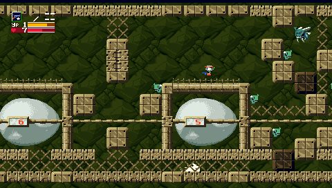
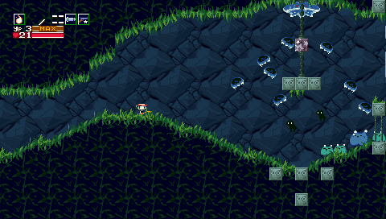
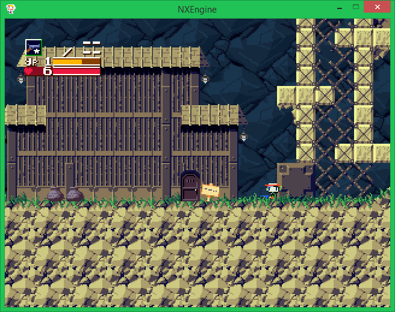
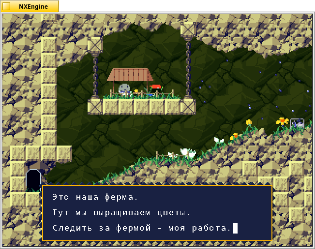
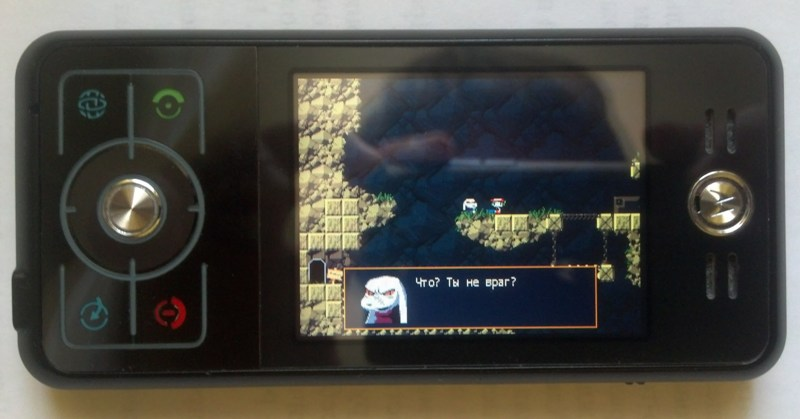

NXEngine
========

NXEngine is open-source rewrite engine of the [Cave Story](https://en.wikipedia.org/wiki/Cave_Story) game. Author - [Caitlin (rogueeve) Shaw](http://nxengine.sourceforge.net/).

This repository contains source code of my NXEngine fork for various weak devices. I have added some engine improvements:

1. Sound through SDL_mixer.
2. Support for widescreen displays (480x272).
3. Ports to various platforms.
4. Russification.

## Download

You can download ready-to-run packages with NXEngine and Cave Story here:

- [On the page of EXL's Developer Blog](http://exlmoto.ru/nxengine/#4).
- [On the page of Cave Story Tribute Fan Site](https://www.cavestory.org/download/cave-story.php).
- [On the page of GitHub Releases](https://github.com/EXL/NXEngine/releases).

Russian and English versions of this game are available.

## Build instructions

Building requires some SDL libraries: SDL-1.2, SDL_ttf-2.0, SDL_mixer-1.2 (optional). Please install developer versions of these libraries before building the project. You can open "nx.pro" project file in the [Qt Creator](https://www.qt.io/download) IDE for easy code navigation.

Platform defines:

| Define | Description |
| --- | --- |
| `-D_480X272` | Use widescreen 480x272 resolution. |
| `-D_320X240` | Use normal 320x240 resolution. |
| `-D_DINGUX` | Dingux platform and keyboard layout (Ritmix RZX-50, Dingoo A320, Dingoo A380, etc). |
| `-D_MOTOMAGX` | MotoMAGX platform and keyboard layout (Motorola ZN5, Z6, E8, EM30, VE66, etc). |
| `-D_MOTOEZX` | MotoEZX platform and keyboard layout (Motorola E2, E6, A1200, A1600). |
| `-D_SDL_MIXER` | Don't use realtime music generation, `*.xm` tracks and sounds will be played via SDL_mixer. |
| `-D_DEBUG` | Enable detailed debug output to the console. |
| `-D_L10N_CP1251` | Enable Russian l10n (you need a `*.ttf` font and Russian version of data-files). |

Please read [addition building information (in Russian)](http://exlmoto.ru/nxengine/#3) in the EXL's Developer Blog.

## Screens

Ritmix RZX-50:

Windows 8.1:

Haiku OS:

## Photos

## Videos

Demonstration [video on YouTube](https://youtu.be/aZPgX9Ismq4) which showing launch Cave Story game with this engine on the Ritmix RZX-50 device.

## More information

Please read [Porting Guide (in Russian)](http://exlmoto.ru/nxengine) for more info about porting NXEngine to various platforms.
